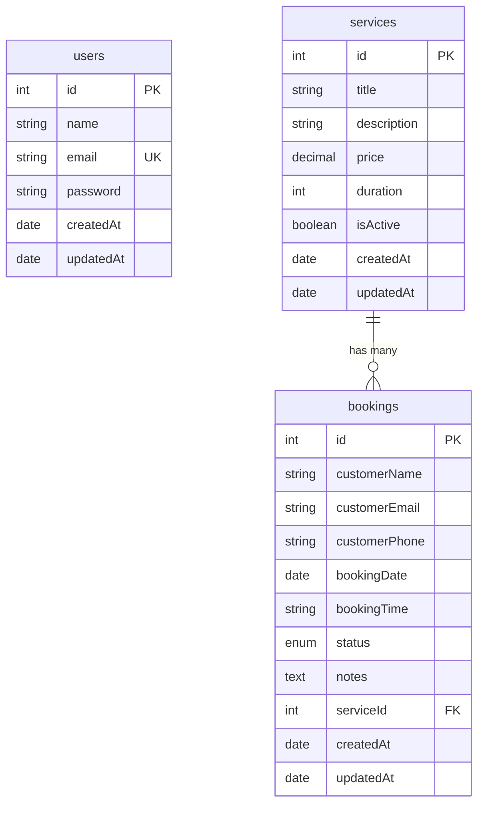

# Booking Platform API

Backend REST API built with NestJS for the EN2H Backend Engineering Internship Assessment.

## Tech Stack

- **Framework**: NestJS
- **Database**: PostgreSQL (TypeORM)
- **Authentication**: JWT & Passport
- **Documentation**: Swagger
- **Validation**: Joi (environment) & Class Validator (requests)
- **Containerization**: Docker & Docker Compose

---

## ER Diagram



---

## Project Structure

```
booking-platform-api/
├── src/
│   ├── auth/
│   │   ├── dto/
│   │   │   ├── login.dto.ts
│   │   │   └── register.dto.ts
│   │   ├── auth.controller.ts
│   │   ├── auth.module.ts
│   │   ├── auth.service.ts
│   │   └── jwt.strategy.ts
│   │
│   ├── bookings/
│   │   ├── dto/
│   │   │   ├── create-booking.dto.ts
│   │   │   ├── query-booking.dto.ts
│   │   │   └── update-booking-status.dto.ts
│   │   ├── entities/
│   │   │   └── booking.entity.ts
│   │   ├── bookings.controller.ts
│   │   ├── bookings.module.ts
│   │   └── bookings.service.ts
│   │
│   ├── common/
│   │   ├── decorators/
│   │   │   └── current-user.decorator.ts
│   │   ├── enums/
│   │   │   └── booking-status.enum.ts
│   │   ├── filters/
│   │   │   └── http-exception.filter.ts
│   │   └── guards/
│   │       └── jwt-auth.guard.ts
│   │
│   ├── database/
│   │   ├── migrations/
│   │   └── data-source.ts
│   │
│   ├── services/
│   │   ├── dto/
│   │   │   ├── create-service.dto.ts
│   │   │   └── update-service.dto.ts
│   │   ├── entities/
│   │   │   └── service.entity.ts
│   │   ├── services.controller.ts
│   │   ├── services.module.ts
│   │   └── services.service.ts
│   │
│   ├── users/
│   │   ├── entities/
│   │   │   └── user.entity.ts
│   │   ├── users.module.ts
│   │   └── users.service.ts
│   │
│   ├── app.module.ts
│   └── main.ts
│
├── Dockerfile
├── docker-compose.yml
├── README.md
├── package.json
└── tsconfig.json
```

---

## Features

- **JWT Authentication**: Secure user registration and login endpoints. Automatically excludes passwords from database serialization and API responses using `class-transformer`'s `@Exclude()` and NestJS global interceptors.
- **Docker Support**: Containerized architecture separating the API and the PostgreSQL database.
- **Robust Validation**: Enforced via Joi (for `.env` files during app bootstrap) and Class Validator (using regex matchers for 10-digit phone numbers and `HH:MM` booking time slots).
- **Service Management**: Fully featured CRUD operations for managing customer-facing services.
- **Advanced Bookings**:
  - Pagination, query searching, and status filtering.
  - Double-booking prevention checking against duplicate date/time slots (ignores cancelled bookings).
  - High-performance database queries optimized via composite indexing.
- **Swagger Documentation**: Interactive API testing playground complete with request/response schemas.

---

## API Endpoints

### Authentication (Public)
* `POST /api/v1/auth/register` — Create a new account
* `POST /api/v1/auth/login` — Authenticate and receive a JWT token

### Services (Mixed Access)
* `GET /api/v1/services` — List all services (Public)
* `GET /api/v1/services/:id` — Get service details by ID (Public)
* `POST /api/v1/services` — Create a service (Admin / Private)
* `PATCH /api/v1/services/:id` — Update service details (Admin / Private)
* `DELETE /api/v1/services/:id` — Delete a service (Admin / Private)

### Bookings (Mixed Access)
* `POST /api/v1/bookings` — Create a new booking (Public)
* `GET /api/v1/bookings` — List bookings with search, filter, pagination (Private)
* `GET /api/v1/bookings/:id` — Get booking details by ID (Private)
* `PATCH /api/v1/bookings/:id/status` — Approve/complete a booking (Private)
* `PATCH /api/v1/bookings/:id/cancel` — Cancel a booking (Private)

---

## How to Run

### Option A: Running with Docker Compose (Recommended)
Make sure you have Docker installed, then run:
```bash
# Build and start services (Postgres + NestJS API)
docker-compose up --build
```
The application will automatically connect, start, and run the API on `http://localhost:3000`.

### Option B: Running Locally
1. Install dependencies:
   ```bash
   pnpm install
   ```
2. Configure `.env` based on `.env.example`.
3. Generate and run migrations:
   ```bash
   # Generate schema migration
   pnpm run migration:generate
   
   # Run migrations
   pnpm run migration:run
   ```
4. Start development server:
   ```bash
   pnpm run start:dev
   ```

Swagger UI will be hosted at `http://localhost:3000/api/v1/docs`.

---

## Future Improvements

1. **Role-Based Access Control (RBAC)**: Differentiate normal users from admins who can create/modify services and approve bookings.
2. **Notification Service**: Automatic emails (e.g. using Nodemailer / AWS SES) to customers upon creation, confirmation, or cancellation of bookings.
3. **Advanced Filtering**: Support date ranges and pagination sorting on services.
