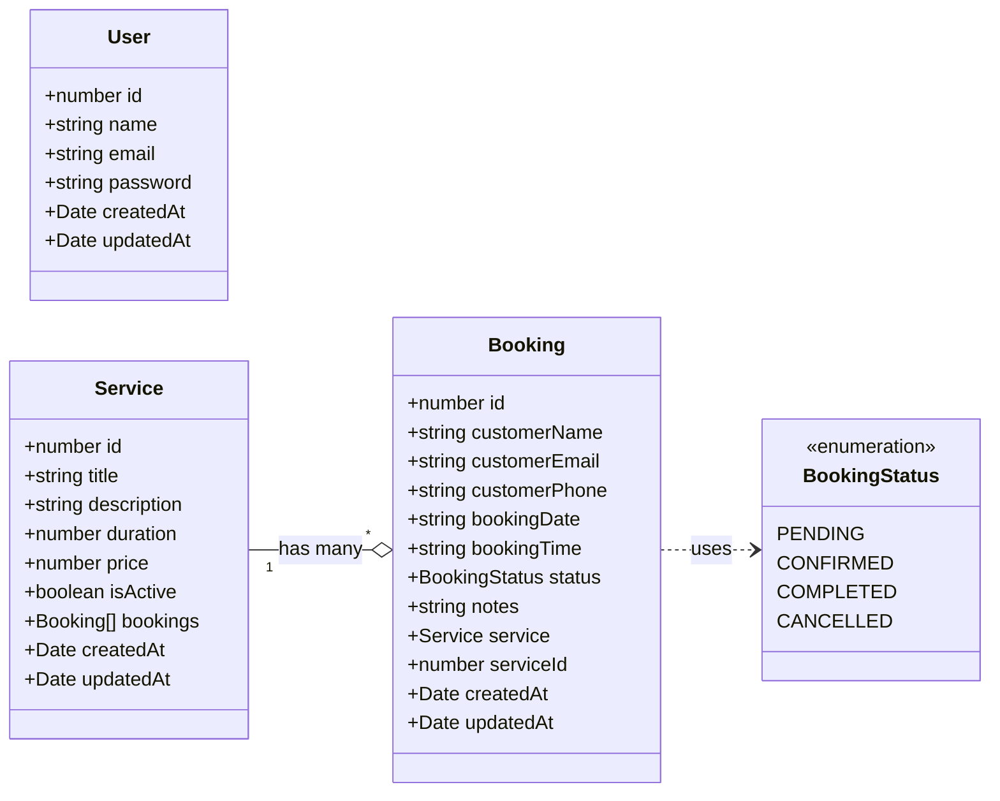

# Booking Platform REST API - Entity Class Diagram

This document contains the UML class diagram representing the system's database entity models.

---

## Class Diagram Representation

---

## Attributes & Field Explanations

### 1. User
- **id**: Numeric serial primary key.
- **name**: User display name.
- **email**: Unique email index (acts as username).
- **password**: Excluded Bcrypt hash string.

### 2. Service
- **id**: Numeric serial primary key.
- **title**: Name of service package.
- **description**: Detailed text explanation.
- **duration**: Integer minutes.
- **price**: Cost formatted as a decimal.
- **isActive**: Catalog boolean availability toggle.

### 3. Booking
- **id**: Numeric serial primary key.
- **customerName**: Client contact name.
- **customerEmail**: Client email validation target.
- **customerPhone**: 10-digit phone format target.
- **bookingDate**: SQL DATE representation target.
- **bookingTime**: 24-hr `HH:MM` format target.
- **status**: Defaults to `PENDING`. Linked to `BookingStatus` enum.
- **notes**: Optional customer details.
- **serviceId**: FK pointing to `Service.id`. Cascade on delete.
