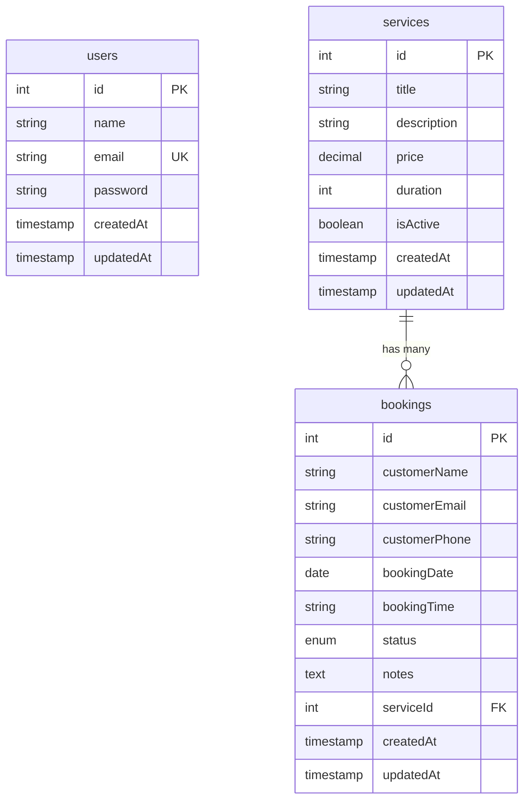

# Booking Platform REST API - Entity Relationship Diagram

This document describes the relational database structure and table mappings using a Mermaid ER Diagram.

---

## 1. Entity Relationship Diagram (ERD)

---

## 2. Relationship Explanations

### 2.1 Services to Bookings (One-to-Many)
- **Cardinality:** `services ||--o{ bookings` (One service has zero, one, or many bookings).
- **Foreign Key:** The `bookings.serviceId` references `services.id`.
- **Constraint Behavior:** Cascade Deletion (`ON DELETE CASCADE`) is active. When a service is deleted, all related bookings in the schedule are deleted to prevent foreign key errors.

### 2.2 Users Entity (Isolated)
- **Role:** Represents authenticated system accounts (Administrators and Privileged Users).
- **Association:** The entity operates independently of the services and bookings tables, providing authentication credentials across administrative operations without direct relational links to client appointments.
